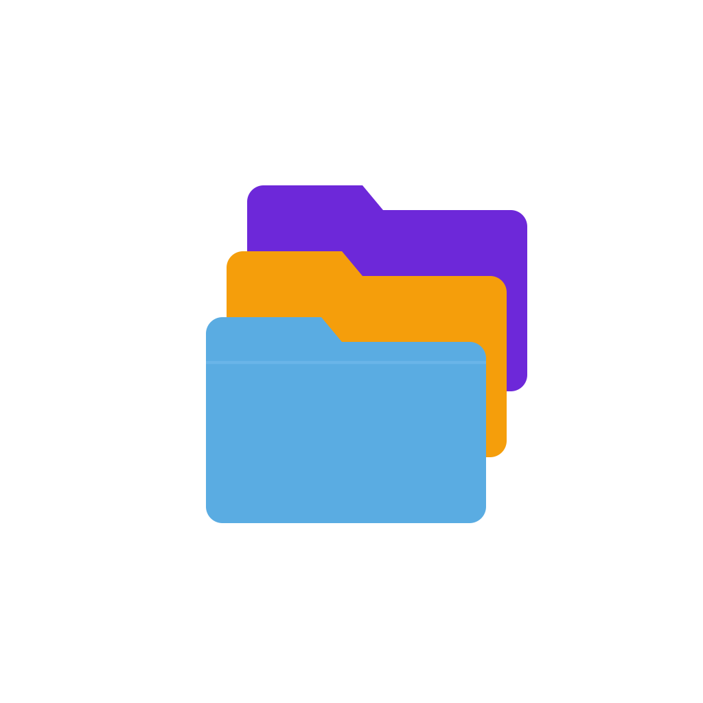

English | [中文](./README.md)

# Haystack

Cross-platform desktop file manager — turn any directory into a searchable, previewable, LAN-shareable file library. Built with Tauri 2 + Rust + a single-page HTML/JS frontend.

<p align="center"></p>

## Features

### Browsing
- **Multiple roots** — mount any number of root directories on one machine (works on macOS / Windows / Linux), with sidebar tree navigation
- **Three views** — list / small thumbnails / large thumbnails, sortable by name / size / date
- **Rich preview**
  - Images (gallery navigation + zoom: Ctrl+wheel / double-click / `+ −` buttons / `Cmd+0` to reset)
  - Video / audio (native webview playback)
  - Code / text (syntax highlighting via highlight.js)
  - Markdown (rendered with marked.js)
  - HTML (iframe preview + one-click view source)
  - PDF (rendered inline via WebKit)
  - Office / archives and other binaries (info card with metadata)
- **Search** — recursive filename search within a root, supports extension search like `.png`
- **Keyboard** — arrow keys, Enter, Backspace, Esc

### Operations
- **Open** — open any file with the system default app (Excel, Preview, Photoshop, ...)
- **New** — templates for text / Markdown / JSON / HTML / JS / Python / xlsx / docx and more
- **Move / Copy** — uses the native folder picker
- **Reveal in Finder / Explorer** — locate the item in the OS file manager
- **Open Terminal** — open a terminal at the file's directory (macOS Terminal / Windows Terminal / gnome-terminal etc.)
- **Bookmarks** — pin folders or files, persisted
- **Color tags** — red / orange / yellow / green / blue / purple / gray, filterable

### LAN sharing (built-in HTTP server)
- An HTTP server starts with the app, prefers port 80 and falls back to 8080
- Each root can have its own URL prefix (e.g. `http://192.168.1.10/projects`)
- Routes map URL prefixes to local directories, automatically exposing them to other machines on the network
- No nginx or other external HTTP server required
- Safety: only roots with an explicit `urlBase` are exposed; others are local-only

### Settings panel (gear button)
- Add / remove roots, configure URL prefixes
- New roots get the local LAN IP + current server port pre-filled as the URL base
- "Copy URL" button builds links using the URL prefix of the file's owning root, with proper handling of Chinese and special characters

### Desktop niceties
- **Menu-bar tray icon** (macOS) — left-click to show window, right-click for the menu (Show / Reload / Settings / Quit)
- **Close button** → hides the window; the app stays in the menu bar. Real quit is via the tray menu
- **Cmd+R / Ctrl+R** reloads the window content

## Requirements

- macOS 11+ (Apple Silicon / Intel)
- Windows 10+ (WebView2 — bundled with Win11; Win10 requires installation)
- Linux (WebKit2GTK)

## Install

Download the package for your platform from [Releases](https://github.com/YvoStudio/Haystack/releases).

### macOS

Download the `.dmg` (`aarch64` for Apple Silicon, `x64` for Intel) and drag it to your Applications folder. The app is Apple-signed and notarized.

### Windows

Download `.msi` or `.exe` and run it. Windows 11 ships with WebView2; on Windows 10 the installer will prompt to install it on first launch.

### Linux

- **Debian / Ubuntu**: download `.deb` and run `sudo dpkg -i Haystack_*.deb`
- **Other distros**: download `.AppImage`, `chmod +x` and run

Runtime deps: `webkit2gtk-4.1`, `libayatana-appindicator3` (for the tray icon). Ubuntu 22.04+ / Debian 12+ usually have these available out of the box.

### Build from source

Requires [Rust](https://rustup.rs/) 1.77+ and Node.js 18+:

```bash
git clone git@github.com:YvoStudio/Haystack.git
cd Haystack
npm install
npx tauri icon src/favicon.svg       # generate icons (first time only)
npm run dev                          # development
npm run build                        # produces a package for the current platform
```

**Extra dependencies on Linux** (Ubuntu/Debian):
```bash
sudo apt install -y libwebkit2gtk-4.1-dev libappindicator3-dev \
    librsvg2-dev patchelf libssl-dev libgtk-3-dev
```

**Windows requirements**: Visual Studio 2022 with the "Desktop development with C++" workload. WebView2 SDK is fetched automatically by Tauri.

## Architecture

- **Frontend** — single file `src/index.html`, no bundling step, plain ES6 + DOM
- **Backend** — Rust (`src-tauri/src/`):
  - `commands.rs` — directory listing, search, file ops, terminal integration
  - `config.rs` — multi-root configuration persistence (`app_config_dir/config.json`)
  - `server.rs` — built-in `tiny_http` static file server, mounts routes per `urlBase`
- **IPC** — Tauri `invoke`; the compatibility shim `src/api.js` rewrites legacy `fetch('/www/_*')` calls to invoke, so the existing frontend code works unchanged

## Config file

```
~/Library/Application Support/io.github.yvo-zym.haystack/config.json    # macOS
%APPDATA%\io.github.yvo-zym.haystack\config.json                         # Windows
~/.config/io.github.yvo-zym.haystack/config.json                         # Linux
```

Format:

```json
{
  "roots": [
    { "name": "Home", "path": "/Users/me", "urlBase": null },
    { "name": "Projects", "path": "/Users/me/projects", "urlBase": "http://192.168.1.10/projects" }
  ]
}
```

You can edit it via the settings panel; the window reloads on save. HTTP routes do not hot-reload yet, so restart the app after changing `urlBase`.

## Contributing

Issues and pull requests are welcome. **By submitting a pull request you agree to assign the copyright and re-licensing rights (including the right to relicense under non-GPL terms) of your contribution to the project author, free of charge.** This keeps the project under a single copyright holder so the author can relicense the code if needed (e.g. for App Store distribution).

If you do not agree to this clause, please do not open a pull request; open an issue for discussion instead.

## License

GPL-3.0-or-later. See [LICENSE](./LICENSE) for the full text.

In short: you may use, modify, and redistribute this code freely, but **derivative works must also be released under a GPL-compatible license**. For closed-source / commercial use, contact the author about a commercial license.
